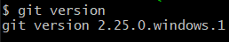
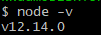
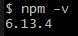

##  INTRODUCTION
Hello Everyone!
I developed this application to extend knowlege of graph algorithms from University course work.
You can explore different types of pathfinding algorithms included in this repositery with the provided step by step installment method.
I hope you whoever playing around my project enjoy the time!
Thank you!

##  HOW TO PLAY WITH IT?
To play around with the project, you will need the following or higher version of tools.
###   Version explanation
1. Git version

2. Node

        
3. npm

-Step by step installments

##  WHAT IS IN THIS PROJECT
###   Features
    -Wall
    Walls can be created by dragging mouse. While pathfinding algorithm searches for paths, such walls are
    ignored as it is considered as "obstacle".
    
    -Algorithms
        Dijsktra Algorithm
        -brief explanation
            -how does it work
            -time complexity
            -worst and best scinario
        
        Greedy Breadth First Search.
        -brief explanation
            -how does it work
            -time complexity
            -worst and best scinario

##      Visual Demonstration
